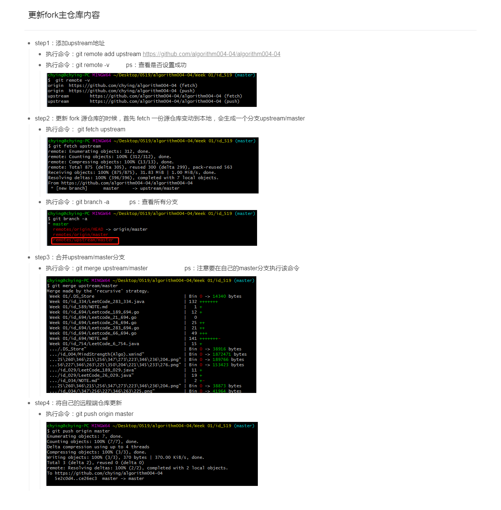

# Week 1总结
    
##习惯养成
1.读题、审题、思考5-10分钟，尽可能多想几种思路，逻辑是否完整
2.如果没有好思路，就用笨办法先做一遍；如果笨办法都没有，切勿死扣，直接看LeetCode官方思路，看完思路后思考用某种具体语言如何实现
3.自己马上写，提交Leetcode验证，提交通过后，是否有优化空间，更好的方案
4.然后去看LeetCode大神解法（国内和国际站点），总结最优解法，在纸上画一画、推一推
5.自己实现最优解法，提交LeetCode

###积极主动
    在完成作业外，每周去review上周其它同学的总结与代码实现，复习
###解题思路
    升维、空间换时、最近重复子问题
    双指针练习

##本周知识点（)
    各有特点，使用场景不一样
###数组、链表、跳表
    1.数组随机访问，插入和新增时间复杂度
    2.链表可以解决数组的插入和新增的复杂度
    3.跳表基于链表的基础上增加索引提升访问效率，每一层索引类似 Next+1、Next+1、Next+3实现，时间复杂度O(Logn)
    4.LeetCode完成LRU缓存机制，下周还需要刷题
> 课后习题
- https://leetcode-cn.com/problems/remove-duplicates-from-sorted-array/
- https://leetcode-cn.com/problems/rotate-array/
- https://leetcode-cn.com/problems/merge-two-sorted-lists/
- https://leetcode-cn.com/problems/merge-sorted-array/
- https://leetcode-cn.com/problems/two-sum/
- https://leetcode-cn.com/problems/move-zeroes/
- https://leetcode-cn.com/problems/plus-one/
###栈、队列、优先队列、双端队列
    1.Stack:先入后出、添加和删除皆为O(1),查询O(n)
    2.Queue:先入先出、添加和删除皆为O(1),查询O(n)
    3.Stack、Queue均可基于数组和链表实现，对其进行操作限制，只允许从两端开始操作
    4.双端队列Deque,队列双端均可Pop、Push,JAVA忘记的差不多了，没有深入java源码
    5.优先队列
> 课后习题
- https://leetcode.com/problems/design-circular-deque
- https://leetcode.com/problems/trapping-rain-water/

>Fork仓库内容更新

###偷师：

- 双指针思想
    涉及到遍历的一些情况，我们都可以考虑用指针，这样可以帮助我们少一层遍历，节省时间复杂度，当然，双指针可能同时从头部开始，也可能同时是从尾部开始，也可能分别从头部和尾部开始，不同的场景，如何设置指针是关键点，目前是有了这个思想，但是没有还没有熟练运用。

- 空间换时间
    说到这个思想，可能第一时间想到的是跳表的原理，当然，在实际解题过程中，如果要求以最快速度或者最低复杂度去读取数据（例如以最快速度取栈内最小值），我们也可以考虑直接把要读取的数据存起来，这样空间复杂度高了，换来的是时间复杂度低了，也就是所谓的空间换时间。

- 栈的应用场景 
    老师的例子很好，洋葱，很形象的展示的栈的一个基本形态，实际过程中，如果遇到类似洋葱的结构，我们都可以考虑是否可以用 栈来解决，例如 有效括号问题。

- 找最近重复性
    计算机本身就是机械重复性的工作，代码也一样，如果我们可以找到一个问题的重复性在哪，即哪一小部分是重复执行的，就离最后的答案不远了，例如 爬楼梯问题