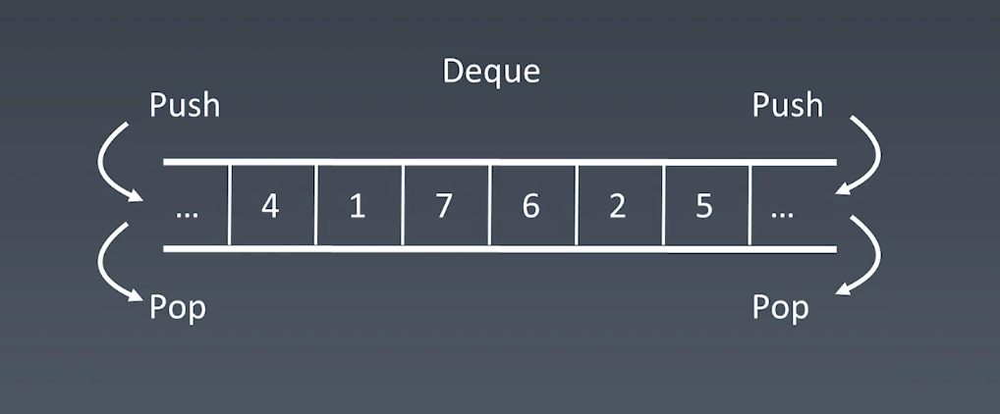

# NOTE

## 数组、链表、跳表

### 数组

**数组(Array)是一种线性表数据结构，使用一组连续的内存空间来存储具有相同类型的数据**

**特性：**

1. 随机访问（O(1)）

    寻址公式：

    ```
    a[i]_address = base_address + i * data_type_size
    ```
2. 插入和删除操作（O(n)）

    在第k个位置插入数据需要将k后面的元素后移一位；将第k个位置的元素删除需要将k后面的元素前移一位

**插入和删除的优化:**

1. 插入时，如果数组无顺序要求，插入时，为了避免大规模数据搬移，可以直接将第k位的数据搬移到最后，把新元素放入第k个位置
2. 删除时，操作只记录该位置元素已删除，并不真正搬移数据，当数组空间不足时再触发搬移数据操作，当然这样增加了维护成本，要根据具体需求而定

**时间复杂度：**

| 操作 | 复杂度 |
|-----|-------|
| prepend | O(1) |
| append  | O(1) |
| lookup  | O(1) |
| insert  | O(n) | 
| delete  | O(n) |

### 链表

**链表不需要一块连续的内存空间，它通过指针将一组零散的内存块串联起来**

每个节点除了存储数据外还要记录下一个节点的地址，头结点记录链表基地址。

常见的结构有：单链表、双链表、循环链表、双向循环链表。循环链表的尾节点的`next`指针指向头结点；双向链表在单链表的基础上增加`prev`指针指向前驱节点，所以支持O(1)的时间复杂度找到前驱节点。

**特性**

1. 插入和删除操作只需要考虑相邻节点的指针变化，时间复杂度为O(1)
2. 随机访问的性能没有数组好，访问第k个元素需要O(n)的时间复杂度

**时间复杂度：**

| 操作 | 复杂度 |
|-----|-------|
| prepend | O(1) |
| append  | O(1) |
| lookup  | O(n) |
| insert  | O(1) | 
| delete  | O(1) |

### 跳表

在链表的基础上，每隔几个节点提取出一个节点到上一级，抽出来一个索引层，索引层节点通过增加一个down指针指向下层节点。

**时间复杂度分析**

按每两个节点抽出一级索引，那第一级就是n/2个节点，以此类推，第k级索引节点个数就是n/(2^k)。如果有h级索引，最高级有2个节点，则`h=log2n - 1`, 每一层最多遍历3个节点，所以
总遍历节点个数最多 `3*h` ，时间复杂度为 O(logn)。

**空间复杂度分析**

其实就是对等比数列求和，空间复杂度为O(n)

**参考资料：**

* LRU Cache - Linked list
    * https://www.jianshu.com/p/b1ab4a170c3c
    * https://leetcode-cn.com/problems/lru-cache
* Redis - Skip List
    * https://redisbook.readthedocs.io/en/latest/internal-datastruct/skiplist.html
    * https://www.zhihu.com/question/20202931

## 栈、队列、双端队列、优先级队列

* 栈(stack)：先入后出 【O(1)】
* 队列(queue)：先进先出 【O(1)】

* 实际应用中更常用双端队列(deque)【O(1)】:

    

* 优先级队列(Priority Queue)：按照元素的优先级取出，插入【O(1)】，取出操作【O(logN)】

**相关源码**

* Stack: http://developer.classpath.org/doc/java/util/Stack-source.html
* Queue: http://fuseyism.com/classpath/doc/java/util/Queue-source.html 
* PriorityQueue https://docs.oracle.com/javase/10/docs/api/java/util/PriorityQueue.html
* Deque https://docs.oracle.com/javase/10/docs/api/java/util/Deque.html
* heapq : https://docs.python.org/2/library/heapq.html
* 高性能的 container 库： https://docs.python.org/2/library/collections.html


## 总结

数组和链表经常被放到一起对比，实际使用还是要看具体应用场景。

数组的缺点是大小固定，初始化就需要确定空间大小，声明过大可能会空间不够，声明过小需要扩容时效率会比较低，但是使用上比较简单，有高效的随机访问能力。链表本身没有大小限制，但是相比数组会占用更多的空间，频繁的插入删除操作会导致频繁的内存申请和释放，容易造成内存碎片。

需要注意的是，说链表的插入、删除复杂度为O(1)是有先决条件的，需要已知要操作节点及其前驱节点的地址才行。对于单链表，实际场景中，如果只给定要操作的节点指针，还需要遍历得到它的前驱节点，才能做后续操作，这时完整的操作时间复杂度就编程O(n)了，这时候用双向向链表就比较合适了。实际应用中，双向链表的应用也更加广泛一些。golang标准库中list的实现就是使用的双向链表。

另外，链表的指针操作看起来很简单，实际编码时很容易出错，一定要注意指针的操作顺序，必要时画图非常有效。

跳表的实现方式很巧妙，明显的加速了链表的查找速度，是很典型的以空间换时间的思维。

**常用的检查链表代码的边界条件：**

1. 链表空时，代码是否正常工作
2. 只有一个或两个节点时，代码是否正常工作
3. 处理头结点、尾节点时，代码是否正常工作

从栈和队列的操作特性上来看，他们都是⼀种“操作受限”的线性表，只允许在⼀端插⼊和删除数据。

从功能上来说，数组或链表是可以替代栈和队列的，但是特定的数据结构是对特定场景的抽象，数组或链表暴露了太多的接口，使用上自然就更容易出错。

## 实战

### 练习

数组：

- [x] https://leetcode-cn.com/problems/container-with-most-water/  (11)
- [x] https://leetcode-cn.com/problems/climbing-stairs/  (70)
- [x] https://leetcode-cn.com/problems/3sum/ (高频老题） (15)

链表：

- [x] https://leetcode-cn.com/problems/reverse-linked-list/  (206)
- [x] https://leetcode-cn.com/problems/swap-nodes-in-pairs  (24)
- [x] https://leetcode-cn.com/problems/linked-list-cycle  (141)
- [ ] https://leetcode-cn.com/problems/linked-list-cycle-ii   (142)
- [ ] https://leetcode-cn.com/problems/reverse-nodes-in-k-group/  (25)

栈、队列

- [x] https://leetcode-cn.com/problems/valid-parentheses/ （- 最近相关性 —> 栈！） (20)
- [ ] https://leetcode-cn.com/problems/min-stack/  (155)
- [ ] https://leetcode-cn.com/problems/largest-rectangle-in-histogram  (84)
- [ ] https://leetcode-cn.com/problems/sliding-window-maximum  (239)

### 作业

数组、链表：

- [x] https://leetcode-cn.com/problems/remove-duplicates-from-sorted-array/ (26)
- [x] https://leetcode-cn.com/problems/rotate-array/ (189)
- [x] https://leetcode-cn.com/problems/merge-two-sorted-lists/ (21)
- [x] https://leetcode-cn.com/problems/merge-sorted-array/ (88)
- [x] https://leetcode-cn.com/problems/two-sum/ (1)
- [x] https://leetcode-cn.com/problems/move-zeroes/ (283) 
- [x] https://leetcode-cn.com/problems/plus-one/ (66)

栈、队列：

- [ ] https://leetcode-cn.com/problems/design-circular-deque  (641)
- [x] https://leetcode-cn.com/problems/trapping-rain-water/  (42)
- [ ] 用add first或add last这套新的API改写Deque的代码
- [ ] 分析Queue和Priority Queue的源码
